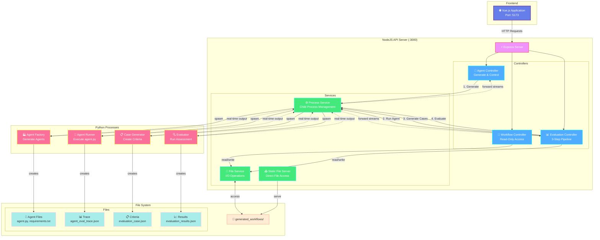

# Agent Factory Architecture Documentation

## System Overview

Agent Factory is a comprehensive system for generating, evaluating, and managing AI agents. It consists of a NodeJS API server that orchestrates Python child processes, and a Vue.js frontend for user interaction.

## Architecture Diagram



## Child Process Architecture

The NodeJS API server operates as a **process orchestrator** that spawns Python child processes to handle different aspects of agent generation and evaluation. This architecture provides several key benefits:

### Process Management Flow

1. **Agent Generation**: When `POST /api/agent/generate` is called, the Agent Controller spawns the Agent Factory Python script as a child process
2. **Evaluation Pipeline**: The Evaluation Controller manages three separate Python processes:
   - **Step 1**: Agent execution (`agent.py` in workflow directory) via `POST /api/evaluation/:path/run-agent`
   - **Step 2**: Evaluation case generation (`eval/generate_evaluation_case.py`) via `POST /api/evaluation/:path/generate-cases`
   - **Step 3**: Evaluation execution (`eval/run_generated_agent_evaluation.py`) via `POST /api/evaluation/:path/run-evaluation`

### Child Process Communication

- **Streaming Output**: All Python processes stream their stdout/stderr back to NodeJS controllers
- **Real-time Updates**: Controllers forward streaming output to frontend via HTTP streaming responses
- **Process Lifecycle**: NodeJS manages process creation, monitoring, and cleanup
- **Interactive Input**: The Input Controller can send user input to running Python processes via stdin

### File System Integration

- **Write Operations**: Python child processes write their outputs directly to the file system:
  - Agent Factory → `agent.py`, `requirements.txt`, `INSTRUCTIONS.md`
  - Evaluation Generator → `evaluation_case.json`
  - Agent Execution → `agent_eval_trace.json`
  - Evaluation Runner → `evaluation_results.json`

- **Read Operations**: NodeJS API directly reads/serves these files:
  - Static File Server serves workflow files to frontend
  - Workflow Controller lists directory contents
  - Evaluation Controller reads trace/criteria files for validation

### Controller Responsibilities

#### Agent Controller (`/api/agent/*`)
- **Primary Role**: Manages agent generation and process control
- **Key Functions**:
  - Spawns Agent Factory Python process for agent generation
  - Handles interactive input to running Python processes
  - Provides emergency stop functionality for long-running operations
- **File Interactions**: Indirectly creates workflow directories through Python processes

#### Evaluation Controller (`/api/evaluation/:workflowPath/*`)
- **Primary Role**: Orchestrates the 3-step evaluation pipeline
- **Key Functions**:
  - **Step 1**: Spawns agent.py execution → creates `agent_eval_trace.json`
  - **Step 2**: Spawns evaluation case generator → creates `evaluation_case.json`
  - **Step 3**: Spawns evaluation runner → creates `evaluation_results.json`
  - Saves custom evaluation criteria and validates file dependencies
  - Provides cleanup operations (delete trace/criteria/results)
- **File Interactions**: Reads trace/criteria files for validation, writes criteria updates

#### Workflow Controller (`/api/workflows/*`)
- **Primary Role**: Provides read-only access to workflow data
- **Key Functions**:
  - Lists all available workflows with file structures
  - Serves workflow details and metadata
  - Provides dedicated endpoints for criteria and results
- **File Interactions**: Only reads workflow files, never writes or modifies

#### Static File Server (`/workflows/:workflowPath/*`)
- **Primary Role**: Direct file serving for frontend access
- **Key Functions**:
  - Serves all workflow files with proper MIME types
  - Handles syntax highlighting support for code files
  - Provides direct file access for file explorer functionality
- **File Interactions**: Serves files directly from filesystem

### Benefits of This Architecture

1. **Language Separation**: Python handles AI/ML logic, NodeJS handles web server logic
2. **Process Isolation**: Each operation runs in its own process space
3. **Streaming Support**: Real-time output without blocking the main server
4. **Scalability**: Multiple operations can run concurrently
5. **Error Isolation**: Python process crashes don't affect the main server
6. **Resource Management**: Processes can be monitored and killed if needed
7. **Clear Separation of Concerns**: Each controller has distinct responsibilities

## NodeJS API Endpoints

### Health Check
- **GET** `/health` - Server health and readiness status
  - Response: `{ status, timestamp, environment, ready }`

### Agent Generation & Control
- **POST** `/api/agent/generate` - Generate agent from prompt
  - Body: `{ prompt: string }` - Agent description/requirements
  - Response: Streaming text output of generation process
  - Creates: New workflow directory with generated agent files

- **POST** `/api/agent/input` - Send input to running Python process
  - Body: `{ input: string }`
  - For interactive agent communication

- **POST** `/api/agent/stop` - Stop running agent process
  - Emergency stop for agent generation

### Workflow Management
- **GET** `/api/workflows` - List all generated workflows
  - Response: Array of workflow objects with files tree
  - Each workflow contains: name, isDirectory, files[]

- **GET** `/api/workflows/:workflowPath` - Get workflow details
  - Response: Detailed workflow information including file structure

- **GET** `/api/workflows/:workflowPath/criteria` - Get evaluation criteria
  - Response: Evaluation criteria JSON/YAML content

- **GET** `/api/workflows/:workflowPath/results` - Get evaluation results
  - Response: Evaluation results JSON content

### Evaluation Pipeline
- **POST** `/api/evaluation/:workflowPath/run-agent` - Run agent for evaluation (Step 1)
  - Executes the generated agent.py file
  - Creates: `agent_eval_trace.json`
  - Response: Streaming execution output

- **POST** `/api/evaluation/:workflowPath/generate-cases` - Generate evaluation cases (Step 2)
  - Auto-generates evaluation criteria using Python script
  - Creates: `evaluation_case.json` with criteria and checkpoints
  - Response: Streaming generation output

- **POST** `/api/evaluation/:workflowPath/run-evaluation` - Run evaluation (Step 3)
  - Compares agent performance against criteria
  - Requires: `agent_eval_trace.json` and `evaluation_case.json`
  - Creates: `evaluation_results.json`
  - Response: Streaming evaluation output

- **POST** `/api/evaluation/:workflowPath/criteria` - Save custom evaluation criteria
  - Body: EvaluationCriteria object
  - Updates: `evaluation_case.json`

### File Management
- **DELETE** `/api/evaluation/:workflowPath/trace` - Delete agent trace
  - Removes: `agent_eval_trace.json` (invalidates results)

- **DELETE** `/api/evaluation/:workflowPath/criteria` - Delete evaluation criteria
  - Removes: `evaluation_case.json` (invalidates results)

- **DELETE** `/api/evaluation/:workflowPath/results` - Delete evaluation results
  - Removes: `evaluation_results.json`

### Static File Serving
- **GET** `/workflows/:workflowPath/*` - Serve workflow files
  - Serves generated agent files, traces, results
  - Content-Type handling for code/text files (.py, .md, .json, .yaml)
  - Direct file access for frontend

## Data Models

### WorkflowFile
```typescript
interface WorkflowFile {
  name: string
  isDirectory: boolean
  files?: WorkflowFile[]
  path?: string
}
```

### EvaluationCriteria
```typescript
interface EvaluationCriteria {
  llm_judge: string
  checkpoints: EvaluationCheckpoint[]
}

interface EvaluationCheckpoint {
  criteria: string
  points: number
}
```

### EvaluationResults
```typescript
interface EvaluationResults {
  score: number
  maxScore: number
  checkpoints: EvaluationCheckpoint[]
}

interface EvaluationCheckpoint {
  criteria: string
  result: 'pass' | 'fail'
  points: number
  feedback: string
}
```

### AgentTrace
```typescript
interface AgentTrace {
  spans: TraceSpan[]
  final_output: string
}

interface TraceSpan {
  name: string
  kind: string
  start_time: number
  end_time: number
  status: { status_code: string; description: string | null }
  attributes: {
    'gen_ai.input.messages'?: string
    'gen_ai.output'?: string
    'gen_ai.tool.args'?: string
    'gen_ai.usage.input_tokens'?: number
    'gen_ai.usage.output_tokens'?: number
    'gen_ai.usage.input_cost'?: number
    'gen_ai.usage.output_cost'?: number
    [key: string]: unknown
  }
}
```

### EvaluationStatus
```typescript
interface EvaluationStatus {
  hasAgentTrace: boolean
  hasEvalCases: boolean
  hasEvalResults: boolean
}
```

## UI Requirements & Features

### Main Views

#### WorkflowsView
- **Purpose**: List all generated agent workflows
- **Features**:
  - Grid/list display of workflows
  - Navigation to workflow details
  - Workflow status indicators

#### WorkflowDetailsView (Primary UI)
- **Purpose**: Main interface for agent management
- **Tabbed Interface**:
  1. **Files Tab**: Browse and view workflow files
  2. **Run Evaluation Tab**: Execute evaluation pipeline
  3. **Agent Trace Tab**: View execution traces (conditional)
  4. **Evaluation Criteria Tab**: View/edit evaluation criteria
  5. **Evaluation Results Tab**: View evaluation results (conditional)

#### AgentEvaluationView
- **Purpose**: Dedicated evaluation interface
- **Features**:
  - Step-by-step evaluation pipeline
  - Real-time streaming output
  - Progress tracking

#### FileView
- **Purpose**: File browser and editor
- **Features**:
  - Syntax highlighting for code files
  - File tree navigation
  - Content preview

#### ChatView
- **Purpose**: Interactive agent communication
- **Features**:
  - Send input to running agents
  - Real-time conversation interface

### Key UI Components

#### AgentFileExplorer
- File tree with syntax highlighting
- File selection and content display
- Support for various file types (.py, .md, .json, .yaml)

#### AgentEvaluationPanel
- Evaluation pipeline controls
- Real-time streaming output display
- Status indicators for each evaluation step

#### EvaluationCriteriaForm
- Dynamic form for editing evaluation criteria
- LLM judge selection
- Checkpoint management (criteria, points)

#### EvaluationResultsViewer
- Score display and breakdown
- Checkpoint results with pass/fail status
- Detailed feedback for each checkpoint

#### AgentEvalTraceViewer
- Trace visualization
- Token usage and cost tracking
- Tool usage analysis

## File System Structure

### Generated Workflows Directory
```
generated_workflows/
├── workflow-name-1/
│   ├── agent.py              # Generated agent code
│   ├── requirements.txt      # Dependencies
│   ├── INSTRUCTIONS.md       # Agent instructions
│   ├── agent_eval_trace.json # Execution trace (after run)
│   ├── evaluation_case.json  # Evaluation criteria
│   └── evaluation_results.json # Evaluation results
├── workflow-name-2/
└── latest/                   # Temporary directory for latest generation
```

## Streaming & Real-time Features

### Server-Sent Events (SSE) Pattern
- All long-running operations use streaming responses
- Real-time output display in UI
- Progress tracking for:
  - Agent generation
  - Agent execution
  - Evaluation case generation
  - Evaluation execution

### Process Management
- Python process lifecycle management
- Interactive input capability
- Graceful shutdown handling

## Critical Python Integration Points

### Environment Management
- Python environment initialization
- Dependency management
- Process spawning and monitoring

### Script Execution
- `eval/generate_evaluation_case.py` - Evaluation case generation
- `eval/run_generated_agent_evaluation.py` - Evaluation execution
- Generated agent execution via `agent.py`

### File Operations
- Workflow directory management
- File serving with proper MIME types
- Cross-platform path handling

## Migration Considerations for New Python API

### Essential Architecture Pattern to Preserve

When migrating from NodeJS to Python, the **child process orchestration pattern** must be maintained to preserve system functionality:

1. **Process Orchestrator Role**: The new Python API server should act as a process manager, spawning child processes for:
   - Agent generation
   - Evaluation pipeline steps
   - Agent execution

2. **Streaming Communication**: Maintain real-time streaming of process output to frontend

3. **File System Integration**: Direct file read/write operations between processes and API server

4. **Process Lifecycle Management**: Ability to start, monitor, and terminate child processes

### Recommended Python Implementation Approach

- **FastAPI** with **asyncio** for non-blocking process management
- **subprocess.Popen** with **StreamingResponse** for real-time output
- **Background tasks** for process monitoring
- **Static file serving** for workflow file access
- **WebSocket** or **Server-Sent Events** for streaming updates

### Critical Compatibility Requirements

1. **Exact endpoint paths** - UI expects specific URL patterns
2. **Response formats** - Especially workflow listing and file serving
3. **Streaming patterns** - Real-time output during long operations
4. **File serving headers** - Proper MIME types for code files
5. **Process control** - Input injection and process termination

This architecture documentation serves as the definitive reference for preserving all functionality during the Python API migration.
