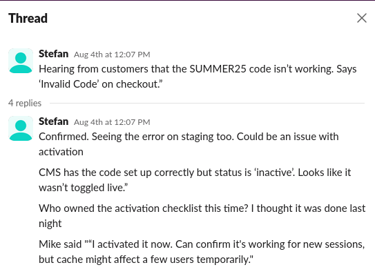
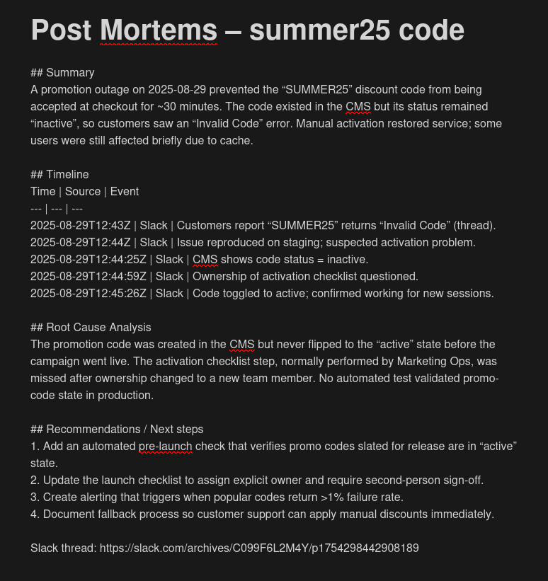

# Use-case: Post-mortem Agent

> A post-mortem is a detailed analysis conducted after an incident has occurred in the context of a business product or service.
> It examines what happened, why it happened, and how similar issues can be prevented in the future.
> Think of it as a thorough review that happens after something went wrong, with the goal of learning from the experience and making improvements.

This guide highlights the use-case of using an AI agent to automate the post-mortem process, gathering context from various sources and generating a comprehensive report.

Specifically, we will be using the following tools to gather context for the incident:
- **Slack**
- **Notion**
- **Monday.com**

And, finally, the agent will generate a post-mortem report under a new Notion page.

As a toy example, we have populated the tools with some data (slack threads between team members, Notion pages with incident reports, and Monday.com tasks) to simulate a real-world scenario, specifically around a _Promo Code (summer25) Error Launch Campaign_ incident. See a snippet of a slack thread that we expect the agent to find and analyze:



<details>

<summary><span style="font-size:1.5em;"><strong>Instructions to Set up our Credentials</strong></span></summary>

The agent will require access to the tools, so we will need to set up credentials for it.


### **Slack**

**Create a `SLACK_BOT_TOKEN`**

1. Open the Slack [API Apps](https://api.slack.com/apps) page.
2. Select Create New App → From scratch.
3. Enter an App Name and choose the Workspace we want to use.
4. Click Create App (the app details page opens).
5. In the left menu under Features, select OAuth & Permissions.
6. In Scopes, select the appropriate scopes for the app.
7. Scroll up to OAuth Tokens and click Install to Workspace (we must be a Slack workspace admin).
8. Select Allow.
9. Copy the Bot User OAuth Token and use it as the `SLACK_BOT_TOKEN`.

**Find the `SLACK_TEAM_ID`**

* Open the workspace in a web browser.
* The team ID is in the URL, usually starts with “T” and is 11 characters long.

**Find the `SLACK_CHANNEL_ID`**

* Open the workspace in a web browser.
* The channel ID is in the URL, usually starts with “C” and is 11 characters long.

### **Notion**

**Create an `INTERNAL_INTEGRATION_TOKEN`**

we can find instructions for getting an `INTERNAL_INTEGRATION_TOKEN` on the [Notion Docs here](https://www.notion.com/help/create-integrations-with-the-notion-api), which will bring you to the [Notion integration](https://www.notion.com/my-integrations) page.

**Create `OPENAPI_MCP_HEADERS`**

1. Copy: `{"Authorization": "Bearer ntn_****", "Notion-Version": "2022-06-28" }`
2. Replace `ntn_****` with the Internal Integration Secret.
3. Enter the text (e.g. `{"Authorization": "Bearer ntn_12345678", "Notion-Version": "2022-06-28" }`) as the `OPENAPI_MCP_HEADERS`.

### **Monday.com**

**Create the `MONDAY_API_TOKEN`**

we can find instructions for getting a `MONDAY_API_TOKEN` on the [Monday.com developer docs here](https://developer.monday.com/api-reference/docs/authentication).

</details>

## Building our Agent

### 1. Start the Agent Factory Server

Let's use [Docker](https://www.docker.com/products/docker-desktop) to run the Agent Factory server. Make sure we have Docker Desktop installed and running, then run the Makefile command to start the server:

```bash
make run
```

After docker has set up the server, we can verify that is up and running at `http://localhost:8080/.well-known/agent.json`.

### 2. Send our Prompt to the Manufacturing Agent

we can now send a request to the Agent Factory server to generate our post-mortem agent. In a terminal, run the following command:

```bash
uv run agent-factory "Create a post-mortem report in Notion in a new page post.
The report should be based on a user provided incident.
Search through Notion pages, the #marketing-ops Slack Channel,
and activity in Monday.com to find out relevant information about the incident.
The final report in Notion should help find the root-cause of the incident and
provide relevant analysis and a timelines."
```

After the command is complete, we should see a new directory under `generated_worfklows` with executable Python code for the agent, as well as all the necessary tools and configurations required to run it. In this case, you can find the actual result under `docs/sample_workflows/post-mortem-agent`.

### 3. Inspect the Target Agent and its requirements

First, let's inspect the generated README.md of the target agent to understand its requirements and how to run it. You can find it [here](../sample_workflows/post-mortem-agent/README.md).

We see that the agent requires some environment variables and a positional argument for the incident description.

> [!NOTE]
> We can also inspect if our Target Agent requires any positional arguments by running:
> ```bash
> uv run --with-requirements requirements.txt --python 3.13 python agent.py --help
> ```


### 4. Fill in the necessary environment variables

Create a `.env` file in the directory of the target agent and add environment variables as instructed in the README.md file with the credentials we set up earlier.

```bash
OPENAI_API_KEY=<your_openai_key>
NOTION_API_KEY=<your_notion_integration_token>
OPENAPI_MCP_HEADERS={"Authorization": "Bearer <your_notion_integration_token>", "Notion-Version": "2022-06-28" }
SLACK_BOT_TOKEN=<your_slack_bot_token>
SLACK_TEAM_ID=<your_slack_team_id>
MONDAY_API_TOKEN=<your_monday_api_token>
```

### 5. Run the Agent

As indicated by the README.md of the post-mortem agent, we can now run the agent with the following command:

```bash
uv run --with-requirements requirements.txt --python 3.13 python agent.py --incident_description "Summer25 code"
```

### 6. Verify that it worked

After the above command is complete, we can verify that the agent has created a new post-mortem report in Notion by navigating to the page specified the last output trace of the agent.

> notion_page_url='https://www.notion.so/Post-Mortems-summer25-code-24fe111ed484813b8052c16a8bb00c53'



Now, any time an incident occurs, we can simply run this agent with a different `incident_description` to generate a new post-mortem report.
